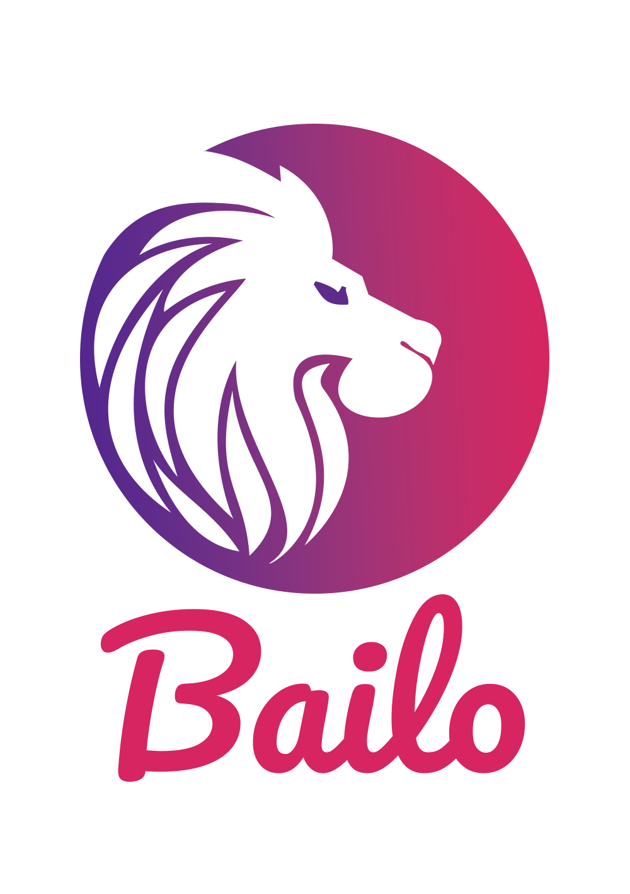
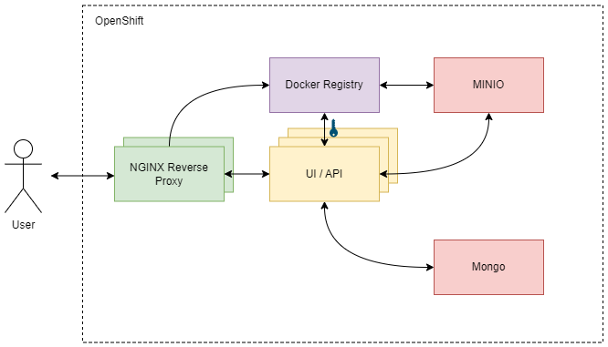

[![Contributors][contributors-shield]][contributors-url] [![Forks][forks-shield]][forks-url]
[![Stargazers][stars-shield]][stars-url] [![Issues][issues-shield]][issues-url]
[![License][license-shield]][license-url] [![Contributor Covenant][code-of-conduct-shield]][code-of-conduct-url]

<!-- PROJECT LOGO -->
<br />
<div align="center">
  <a href="https://github.com/gchq/Bailo">
    <h1>
      <!-- TODO: Fix #gh-dark-mode-only -->
      
    </h1>
  </a>

  <p align="center">
    Making it easy to compliantly manage the machine learning lifecycle
    <br />
    <a href="https://gchq.github.io/Bailo/docs"><strong>Explore the docs »</strong></a>
    <br />
    <br />
    <a href="https://github.com/gchq/Bailo/issues">Report a Bug</a>
    ·
    <a href="https://github.com/gchq/Bailo/issues">Request a Feature</a>
  </p>
</div>

<!-- TABLE OF CONTENTS -->
<details>
  <summary>Table of Contents</summary>
  <ol>
    <li>
      <a href="#about-the-project">About The Project</a>
      <ul>
        <li><a href="#built-with">Built With</a></li>
      </ul>
    </li>
    <li>
      <a href="#getting-started">Getting Started</a>
      <ul>
        <li><a href="#requirements">Requirements</a></li>
        <li><a href="#installation">Installation</a></li>
        <li><a href="#service-ports">Service Ports</a></li>
        <li><a href="#logical-project-flow-overview">Logical Project Flow (Overview)</a></li>
        <li><a href="#known-issues">Known Issues</a></li>
      </ul>
    </li>
    <li><a href="#usage">Usage</a></li>
    <li><a href="#contributing">Contributing</a></li>
    <li><a href="#breaking-changes">Breaking Changes</a></li>
    <li><a href="#license">License</a></li>
    <li><a href="#acknowledgments">Acknowledgments</a></li>
  </ol>
</details>

<br />

<!-- ABOUT THE PROJECT -->

## About The Project

[![Product Screen Shot][product-screenshot]](https://github.com/gchq/Bailo)

Bailo helps you manage the lifecycle of machine learning to support scalability, impact, collaboration, compliance and
sharing.

### Built With

- [Next.js](https://nextjs.org/)
- [Node.js](https://nodejs.org/)
- [MongoDB](https://www.mongodb.com/)
- [Seldon](https://www.seldon.io/)

<br />

<!-- GETTING STARTED -->

## Getting Started

### Requirements

- Node v22
- Docker / Docker Compose

<br />

### Installation

To run in standalone mode, not development mode (http://localhost:8080). Not for production use:

```bash
docker build -t "bailo:standalone" -f ./Dockerfile.standalone .
docker run --name bailo -p 8080:8080 -d bailo:standalone
```

To run in development mode (modified files on your host machine will be reloaded into the running application):

```bash
git clone https://github.com/gchq/Bailo.git && cd Bailo
npm install
npm run certs

# This builds all the Bailo images, rerun it when you update dependencies.
docker compose build --parallel

# Then run the development instance of Bailo.
docker compose up -d
```

On first run, it may take a while (up to 30 seconds) to start up. It needs to build several hundred TypeScript modules.
These are cached however, so future starts only require a few seconds. You should access the site via
[localhost:8080](http://localhost:8080).

The registry requires a JWKS file for the token authentication with the backend application. For development, a JWKS
file is generated by running `npm run certs`. For production, the script `generateJWKS.ts` can be used to generate a
JWKS file for the public key referenced in the backend application configuration.

<br />

### Service Ports

| Service    | Host  | Notes                 |
| ---------- | ----- | --------------------- |
| Next UI    | 3000  | Stored in `frontend`  |
| NodeJS App | 3001  | Stored in `backend`   |
| Mongo      | 27017 | No credentials        |
| Registry   | 5000  | HTTPS only, no UI     |
| Minio UI   | 9001  | minioadmin:minioadmin |
| Minio      | 9000  | minioadmin:minioadmin |
| MailCrab   | 1080  | Fake email server     |

\*\* Note: these credentials are intentionally basic/default, but in your own instances we recommend changing them to
something more secure.

We expect the administrator to provide their own forms of authentication. By default all users authenticate using as
'user'.

You can test out your new deployment using the example models which can be found in `frontend/cypress/fixtures`
[`minimal_binary.zip`](frontend/cypress/fixtures/minimal_binary.zip) and
[`minimal_code.zip`](frontend/cypress/fixtures/minimal_code.zip). There are also example forms in the `scripts` folder
[`minimal_model_schema.json`](backend/src/scripts/example_schemas/minimal_model_schema.json),
[`minimal_data_card_schema.json`](backend/src/scripts/example_schemas/minimal_data_card_schema.json) and
[`minimal_access_request_schema.json`](backend/src/scripts/example_schemas/minimal_access_request_schema.json).

<br />

### Logical Project Flow (Overview)



1. A user accesses a URL. We use [NextJS routing](https://nextjs.org/docs/routing/introduction) to point it to a file in
   `frontend/pages`. `[xxx].tsx` files accept any route, `xxx.tsx` files allow only that specific route.
2. Data is loaded using [SWR](https://swr.vercel.app/). Data loaders are stored in `frontend/actions`. Each one exposes
   variables to specify if it is loading, errored, data, etc.
3. Requests to the backend get routed through [express](https://expressjs.com/) within `backend/src/routes.ts`. Each
   route is an array with all items being middleware except the last, which is the handler (`[...middleware, handler]`).
4. Routes interact with the database via `mongoose`, which stores models in `backend/src/models`.

<br />

### Known Issues

- _Issue: Sometimes Docker struggles when you add a new dependency._ <br /> Fix: Run `docker compose down --rmi all`
  followed by `docker compose up --build`.

- _Issue: Sometimes SWR fails to install its own binary and the project will refuse to start up (development only)_
  <br /> Fix: Run `npm uninstall next && npm install next`. Some users report still having issues. If so, run:
  `rm -rf node_modules && rm -rf package-lock.json && npm cache clean -f && npm i`.

- _Issue: Unable to authenticate to the Docker registry / compile binaries._ <br /> Fix: Make sure that your
  authentication proxy is setup to allow the 'Authorisation' header. Make sure that your application is able to access
  the Docker registry internally as it will not provide user authentication.

<br />

## Usage

See [our user documentation](https://gchq.github.io/Bailo/docs)

<br />

<!-- ROADMAP -->

## Roadmap

- [ ] Export/Import of Releases with Files.
- [ ] Model LifeCycle State.
- [x] Model Organisation.
- [x] Improve Open Source Ways of Working.
- [ ] Export/Import of Releases with Docker Images.

<br />

<!-- CONTRIBUTING -->

## Contributing

If you'd like to make a contribution then the details for doing all of that are in
[CONTRIBUTING.md](https://github.com/gchq/Bailo/blob/main/CONTRIBUTING.md).

<br />

<!-- LICENSE -->

## License

Bailo is released under the Apache 2.0 Licence and is covered by Crown Copyright. See [LICENSE.txt][license-url] for
more information.

<br />

<!-- ACKNOWLEDGMENTS -->

## Acknowledgments

- [Othneils's README Template](https://github.com/othneildrew/Best-README-Template)
- [Stroom's Code Contribution Guidelines](https://github.com/gchq/stroom/blob/master/CONTRIBUTING.md)

<!-- MARKDOWN LINKS & IMAGES -->
<!-- https://www.markdownguide.org/basic-syntax/#reference-style-links -->

[contributors-shield]: https://img.shields.io/github/contributors/gchq/bailo.svg?style=for-the-badge
[contributors-url]: https://github.com/gchq/Bailo/graphs/contributors
[forks-shield]: https://img.shields.io/github/forks/gchq/bailo.svg?style=for-the-badge
[forks-url]: https://github.com/gchq/Bailo/network/members
[stars-shield]: https://img.shields.io/github/stars/gchq/bailo.svg?style=for-the-badge
[stars-url]: https://github.com/gchq/Bailo/stargazers
[issues-shield]: https://img.shields.io/github/issues/gchq/bailo.svg?style=for-the-badge
[issues-url]: https://github.com/gchq/Bailo/issues
[license-shield]: https://img.shields.io/github/license/gchq/bailo.svg?style=for-the-badge
[license-url]: https://github.com/gchq/Bailo/blob/main/LICENSE.txt
[code-of-conduct-shield]: https://img.shields.io/badge/Contributor%20Covenant-2.1-4baaaa.svg?style=for-the-badge
[code-of-conduct-url]: https://github.com/gchq/Bailo/blob/main/CODE_OF_CONDUCT.md
[product-screenshot]: frontend/public/images/bailo-marketplace.png
