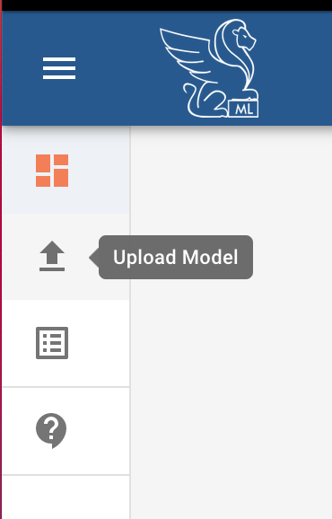
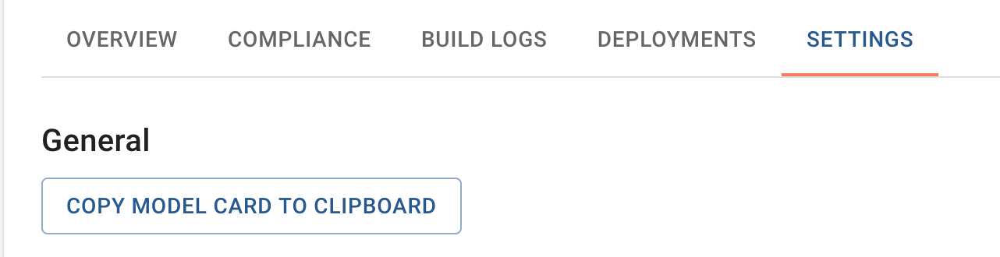
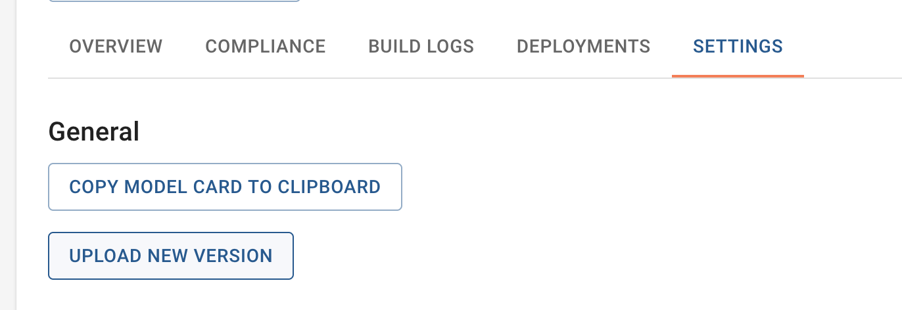
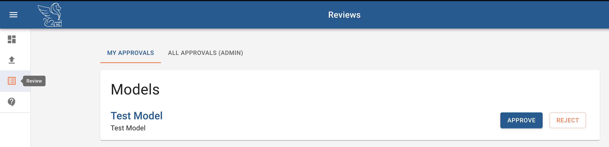

# Getting started

Bailo is an application to store, discover, and share machine learning models.

## Marketplace

The Marketplace is the default landing page when you access Bailo. You can return to it from any other location in Bailo
by clicking the Marketplace icon:

<div></img></div>

Models in Bailo are viewable in the Marketplace, and you can use the "Filter Models" search bar to look for specific
(types of) models.

In the future, only approved models will be visible via the Marketplace.

## Uploading models

As a user with the Uploader role, you can submit a model by clicking on the Upload Model icon on the left-hand side of
the screen:

<div></img></div>

This will take you to a page to upload your model's code, binary, and model card details. In order to submit your model
you can either use the 'Create Model' tab to enter in the details of your model via an interactive form, or you can
submit JSON via the 'Upload Model' tab.

You can get the json string containing a model's metadata from its "Settings" tab, then clicking "Copy Model Card to
Clipboard":

<div></img></div>

This json string can be used as a template for uploading additional models via the "Upload Model" tab.

After submitting a model, you'll be redirected to your model's url within Bailo. You'll also be able to view your model
in the "My Models" page, and it will be visible in the marketplace.

In the future, only approved models will be visible in the marketplace.

### Code File Format

As a model contributor you must develop your model code in Python and structure it in accordance with the guidelines
laid out on this page. This includes making use of a template model class, which has the benefit of providing
consistency with respect to the code structure, but avoids imposing unnecessary restrictions. At present, this class
must be present in your codebase but the intention is to make it available for import as an external library.

The model code is uploaded as a <b>zip file</b> or a <b>docker container</b> on the upload files section on the user
interface upload form. The uploaded code must contain:

- The top-level model class
- Any supporting code
- An associated requirements.txt detailing any python library dependencies and their versions.

We provide a basemodel class that contains the functions:

- predict
- metrics
- metadata

As a model contributor, you need to import this and use it as a super class to your model code and, at minimum,
instantiate the predict method in order to create a valid model. This approach allows you to test your model code
externally, while ensuring minimal integration work is required when submitting the model to Bailo.

The basemodel can be found [here](../examples/example_model_code/basemodel/basemodel.py), but the contents are also
provided below for easy reference.

**basemodel.py**

```python
from abc import ABC, abstractmethod

class BaseModel(ABC):
    """
    The BaseModel class provides an abstract template for model contributors.
    Models must provide a predict method but do not have to provide metrics or metadata
    """

    def __init__(self):
        """
        The model should be loaded here in the Model sub-class generated
        from the BaseModel abstract class
        """
        # self.model = load_model("model")
        super().__init__()

    @abstractmethod
    def predict(self, input, features_names):
        """
        Provides a model prediction for a given input and set of feature names
        :param input: Prediction input containing a data component
        :param feature_names: Optional set of feature names
        :return: JSON serialisable numpy array, list of values, string or bytes
        """
        # data = input["data"]
        # result = self.model.predict(data)
        result = []
        return result

    def metrics(self):
        """
        Optional method for adding additional metrics
        :return:
        """
        # return an array of metrics tuples
        metrics =  [{"type": "COUNTER", "key": "basemodel_counter", "value": 1}]
        return metrics

    def metadata(self):
        """
        Optional metadata method.
        :return:
        """
        # meta = {"field": "value"}
        meta = {}
        return meta
```

**Example - model.py**

```python
import fasttext
import numpy as np
import json

from basemodel import BaseModel

    class Model(BaseModel):
        """
        This class loads the FastText lid.176.bin language ID model.
        It instantiates the predict abstract method from the BaseModel class
        and overwrites the metrics method.
        """

        def __init__(self):
            """
            Constructor, which loads the lid model and calls the constructor method
            of the BaseModel super class.
            """
            self.model = fasttext.load_model("lid.176.bin")

        def predict(self, input, features_names=None):
            """
            Generate a prediction from the model given the specified input data and feature names.
            :param input: Dictionary containing a data key with a text value
            :param feature_names: Set of feature names to be applied (not used in this model)
            :return: Dictionary containing an array of predictions and an array of probabilities
            """
            data = input["data"]
            (self.predictions, probabilities) = self.model.predict(data)
            self.probabilities = [float(p) for p in probabilities]

            # Need to convert probabilities from ndarry to floats, as cant serialize numpy objects
            # We can't rely on the order of these being maintained. This needs to be corrected.
            return {"predictions": self.predictions, "probabilites": self.probabilities}

        def metrics(self):
            """
            Generate model metrics for prediction count and metadata.
            :return: Array of dictionary tuples
            """
            # Add metrics for prediction count and metadata
            metrics =  [
              {"type": "COUNTER", "key": "predictions_total", "value": 1},
              {"type": "GAUGE", "key": "model_meta", "value": 1}
            ]
            # Track confidence metrics
            for i in range(len(self.predictions)):
                metrics.append(
                    {
                        "type": "GAUGE",
                        "key": "prediction_confidence_{}".format(self.predictions[i][0]),
                        "value": self.probabilities[i]
                    }
                )
            return metrics
```

The current approach does not specify the allowable return types from the model's predict method prior to wrapping.
However, the return type must be json serializable and this may present difficulties where the type returned is complex
or contains non-serializable types (such as numpy floats within dictionaries or arrays within dictionaries).

As a model contributor you must therefore perform any necessary conversions to ensure that the output of the predict
method is json serialisable. This includes external models, such as those available from opensource or commercially
acquired. In these cases you will need to perform the necessary conversion in the model class but this will not impact
on the acquired model itself.

### Binary File Format

The model binary is the raw model generated through training. It may be generated internally or imported as an open
source or commercially acquired pre-trained model.

There are no restrictions on the framework used to generate the model but details of the training approach and training
data need to be provided within the associated model card.

The model binary is loaded into a model class provided by the supporting model code and is included in the image
generated by Bailo. When this image is deployed within a target environment it exposes a set of endpoints, one of which
is the predict endpoint that's used to retrieve the model's results.

If the supporting model code expects the trained model to be located at a particular path location then the structure of
the <b>zip file</b> must mirror these expectations. The binary <b>zip file</b> is expanded at the top level of the model
code.

### Supported Models

Bailo currently builds model images using
[seldonio's Python 3.7 s2i image](https://hub.docker.com/r/seldonio/seldon-core-s2i-python37). This means Bailo
currently only supports models that can be run with Python 3.7. Generally, the packages your model uses need to be
pip-installable and listed in the [requirements.txt](../examples/example_model_code/requirements.txt) file. NumPy (1.21
as of this writing) is provided, by default.

## Requesting a deloyment

Once a model has been added to the marketplace, it can be found by other users. If the model matches a user's use case,
they can request a deployment of the model (by clicking "Request Deployment" on a model's page). Similar to the model
upload form, there's a deployment request form to fill out (along with an option to request a deployment with the form
data populated in a json string, via the "Upload Deployment" tab).

Similar to the model upload form, you will need to supply a secondary POC for the deployment (someone to contact about
the deployment if the deployment owner is unable to be reached).

If your request is approved by the model's manager, then a Docker image corresponding to the requested model is made
available. You are then able to pull this image and run it on your own infrastructure.

## Updating a model

Updating a model is not yet implemented, however in the future models can be updated by going to the model's url,
clicking the settings tab, then clicking "Upload New Version":

<div></img></div>

At present, this links to the page to just upload a new model.

## Approving a Request

Models awaiting your approval are viewable on the Reviews page, which can be reached by clicking the "Review" icon:

<div></img></div>

Approve or reject a model by clicking the associated button.

## FAQ

### When should I upload a model?

You should consider uploading a model once you have trained and tested it in your own environment and you feel that it
is production ready. Bailo is not intended to hold models until they have reached this point, so any development must be
carried out in an external environment.

### What roles can a user have and how do they limit available actions?

Currently, Bailo has **user** and **admin** roles. A **user** can upload and approve models (as both a manager and
reviewer, as identifed during model upload). In the future, Bailo intends to support the following roles:

- **Uploader**: This is the main role for users, it allows users to upload and explore models, as well as request
  deployments of models.
- **Manager**: All models uploaded to Bailo are assigned a model manager. This person is responsible for the model and
  ensuring that it follows its lifecycle plan. The manager approves the upload of the model and all its deployments
  considering any business risks and costs associated with doing so.
- **Reviewer**: Reviewer: All models uploaded to Bailo are assigned a model reviewer. The reviewer approves the upload
  of the model from a technical perspective considering the development details, the performance evaluation, assessed
  risks, limitations, bias and ethical considerations.
- **Admin**: Has all accesses for the tool, but will only be used by a small number of permitted users.
